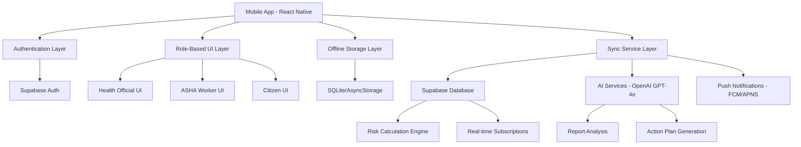

# Design Document

## Overview

Jal Suchak is a React Native mobile application that serves as an AI-powered public health command center. The app provides role-based interfaces for three user types: Health Officials (comprehensive command center), ASHA Workers (field reporting tools), and Citizens (simplified alerts and reporting). The design emphasizes offline-first functionality, real-time data synchronization, and AI-powered analytics.

## Architecture

### High-Level Architecture



### Technology Stack

**Frontend:**
- React Native with Expo for cross-platform development
- React Navigation for screen navigation
- React Native Maps for interactive mapping
- AsyncStorage for local data persistence
- React Native Push Notifications for alerts

**Backend:**
- Supabase for authentication, database, and real-time features
- Supabase Edge Functions for scheduled tasks and AI integration
- Row Level Security (RLS) for role-based data access

**AI Integration:**
- OpenAI GPT-4o for report analysis and conversational AI
- XGBoost model API for risk prediction
- Model Context Protocol for AI memory management

## Components and Interfaces

### Core Components

#### 1. Authentication System
```typescript
interface AuthService {
  authenticateWithAadhaar(aadhaarNumber: string): Promise<OTPResponse>
  verifyOTP(otp: string): Promise<AuthResult>
  verifyProfessional(idNumber: string, document: File): Promise<VerificationResult>
  getCurrentUser(): User | null
  logout(): Promise<void>
}

interface User {
  id: string
  aadhaarNumber: string
  role: 'citizen' | 'asha' | 'official'
  isVerified: boolean
  profileData: UserProfile
}
```

#### 2. Role-Based Navigation
```typescript
interface NavigationConfig {
  citizen: TabConfig[]
  asha: TabConfig[]
  official: TabConfig[]
}

interface TabConfig {
  name: string
  component: React.ComponentType
  icon: string
  badge?: number
}
```

#### 3. Offline Data Management
```typescript
interface OfflineService {
  storeReport(report: HealthReport): Promise<void>
  getQueuedReports(): Promise<HealthReport[]>
  syncPendingData(): Promise<SyncResult>
  isOnline(): boolean
  getOfflineStatus(): OfflineStatus
}

interface HealthReport {
  id: string
  userId: string
  location: GeoLocation
  symptoms: string[]
  description: string
  photos: string[]
  timestamp: Date
  synced: boolean
}
```

#### 4. AI Integration Service
```typescript
interface AIService {
  analyzeReport(report: HealthReport): Promise<AIAnalysis>
  generateActionPlan(districtData: DistrictData): Promise<ActionPlan>
  chatWithCopilot(message: string, context: ChatContext): Promise<AIResponse>
  generateBroadcast(topic: string): Promise<BroadcastMessage>
}

interface AIAnalysis {
  summary: string
  entities: ExtractedEntity[]
  riskLevel: 'low' | 'medium' | 'high' | 'critical'
  recommendations: string[]
}
```

#### 5. Map and Visualization
```typescript
interface MapService {
  getDistrictPolygons(): Promise<GeoPolygon[]>
  getRiskLayers(): Promise<RiskLayer[]>
  getHeatmapData(): Promise<HeatmapPoint[]>
  updateMapLayers(layerType: 'risk' | 'heatmap'): void
}

interface DistrictData {
  id: string
  name: string
  population: number
  riskScore: number
  iotData: SensorData[]
  fieldReports: HealthReport[]
}
```

### Screen Components Architecture

#### Authentication Flow
- **WelcomeScreen**: Entry point with branding and login CTA
- **AadhaarEntryScreen**: Formatted input with validation
- **OTPVerificationScreen**: 6-digit code input with demo hint
- **ProfessionalVerificationScreen**: ID input and document upload simulation

#### Health Official Interface
- **OfficialDashboard**: Interactive map with district visualization
- **DistrictDetailsModal**: Comprehensive district intelligence panel
- **AICopilotInterface**: Conversational AI with action planning
- **ReportAnalysisModal**: AI-powered report analysis with entity highlighting
- **BroadcastScreen**: Community announcement generation

#### Field User Interface
- **FieldUserDashboard**: Simplified heatmap and quick actions
- **NewReportForm**: Offline-capable reporting with media capture
- **EducationalModule**: Offline health guides with visual content
- **MCPCardDemo**: Mock digital health card prototype (ASHA only)

#### Shared Components
- **NotificationsScreen**: Alert history and preference management
- **ProfileScreen**: User settings and role information
- **OfflineIndicator**: Global connectivity status banner
- **AICommunityResponder**: Post-report acknowledgment modal

## Data Models

### User Management
```typescript
interface UserProfile {
  id: string
  aadhaarNumber: string
  role: UserRole
  name?: string
  location?: GeoLocation
  language: 'en' | 'kh'
  notificationPreferences: NotificationSettings
  verificationStatus: VerificationStatus
}

interface VerificationStatus {
  aadhaarVerified: boolean
  professionalVerified: boolean
  documentId?: string
  verificationDate?: Date
}
```

### Health Data
```typescript
interface HealthReport {
  id: string
  userId: string
  reportType: 'field_observation' | 'citizen_concern'
  location: GeoLocation
  symptoms: SymptomData[]
  description: string
  severity: 1 | 2 | 3 | 4 | 5
  photos: MediaFile[]
  timestamp: Date
  aiAnalysis?: AIAnalysis
  status: 'pending' | 'analyzed' | 'escalated'
}

interface DistrictRisk {
  districtId: string
  riskScore: number
  riskLevel: RiskLevel
  factors: RiskFactor[]
  lastUpdated: Date
  iotData: SensorReading[]
}
```

### AI and Analytics
```typescript
interface ActionPlan {
  id: string
  districtId: string
  situation: string
  actions: ActionItem[]
  resources: ResourceRequirement[]
  timeline: string
  generatedAt: Date
}

interface ActionItem {
  id: string
  description: string
  completed: boolean
  assignee?: string
  priority: 'low' | 'medium' | 'high' | 'critical'
  resourceStatus: 'available' | 'low_stock' | 'unavailable'
}
```

## Error Handling

### Offline Error Management
- **Network Failures**: Queue operations locally with retry mechanisms
- **Sync Conflicts**: Implement conflict resolution with user prompts
- **Data Corruption**: Validate data integrity with checksums
- **Storage Limits**: Implement data cleanup policies for old cached data

### AI Service Errors
- **API Failures**: Provide fallback responses and retry logic
- **Rate Limiting**: Implement exponential backoff and user feedback
- **Invalid Responses**: Parse and validate AI outputs with error recovery

### Authentication Errors
- **Token Expiry**: Automatic refresh with seamless user experience
- **Role Mismatches**: Clear error messages with appropriate redirects
- **Verification Failures**: Detailed feedback with retry options

## Testing Strategy

### Unit Testing
- **Component Testing**: React Native Testing Library for UI components
- **Service Testing**: Jest for business logic and API services
- **Utility Testing**: Pure function testing for data transformations

### Integration Testing
- **Authentication Flow**: End-to-end user registration and login
- **Offline Sync**: Data persistence and synchronization scenarios
- **AI Integration**: Mock AI responses and error handling

### User Acceptance Testing
- **Role-based Workflows**: Complete user journeys for each persona
- **Offline Scenarios**: App functionality without internet connectivity
- **Cross-platform**: iOS and Android feature parity testing

### Performance Testing
- **Map Rendering**: Large dataset visualization performance
- **Offline Storage**: Local database query optimization
- **Background Sync**: Battery and data usage optimization

## Security Considerations

### Data Protection
- **Encryption**: AES-256 for local storage, TLS for transmission
- **Authentication**: JWT tokens with refresh mechanism
- **Authorization**: Role-based access control with RLS policies

### Privacy Compliance
- **Data Minimization**: Collect only necessary health information
- **User Consent**: Clear opt-in for data collection and notifications
- **Data Retention**: Automatic cleanup of old reports and cached data

### API Security
- **Rate Limiting**: Prevent abuse of AI and backend services
- **Input Validation**: Sanitize all user inputs and file uploads
- **Audit Logging**: Track sensitive operations and data access

## Deployment and DevOps

### Build Pipeline
- **Expo EAS Build**: Automated builds for iOS and Android
- **Environment Management**: Separate configs for dev/staging/production
- **Code Signing**: Automated certificate management

### Monitoring and Analytics
- **Crash Reporting**: Sentry for error tracking and performance monitoring
- **Usage Analytics**: Privacy-compliant user behavior tracking
- **Performance Metrics**: App startup time, sync performance, battery usage

### Backend Infrastructure
- **Supabase Hosting**: Managed database and authentication
- **Edge Functions**: Serverless AI integration and scheduled tasks
- **CDN**: Global content delivery for educational materials